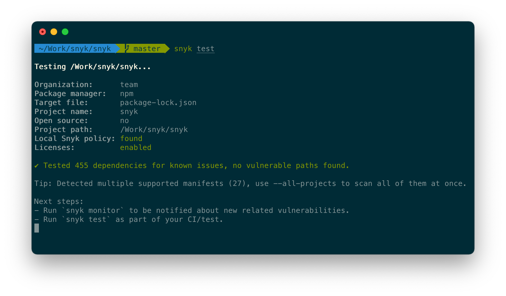

<p align="center">
  
</p>

# Snyk CLI

[Snyk](https://snyk.io) scans and monitors your projects for security vulnerabilities.



# What is [Snyk](https://snyk.io)?

[Snyk](https://snyk.io) is a developer-first cloud-native security tool.
It covers multiple areas of application security:

1. [**Snyk Open Source**](https://snyk.io/product/open-source-security-management/): Find and automatically fix open source vulnerabilities
2. [**Snyk Code**](https://snyk.io/product/snyk-code/): Find and fix vulnerabilities in your application code in real time
3. [**Snyk Container**](https://snyk.io/product/container-vulnerability-management/): Find and fix vulnerabilities in container images and Kubernetes applications
4. [**Snyk Infrastructure as Code**](https://snyk.io/product/infrastructure-as-code-security/): Find and fix insecure configurations in Terraform and Kubernetes code

[Learn more about what Snyk can do and sign up for a free account »](https://snyk.io)

# What is Snyk CLI?

Snyk CLI brings the functionality of [Snyk](https://snyk.io) into your development workflow. It can be run locally or in your CI/CD pipeline to scan your projects for security issues.

## Supported languages and tools

Snyk supports many languages and tools, including Java, .NET, JavaScript, Python, Golang, PHP, C/C++, Ruby, Scala and more. See our [Language Support documentation](https://support.snyk.io/hc/en-us/articles/360020352437-Language-support-summary).

CLI also supports [Docker scanning](https://support.snyk.io/hc/en-us/articles/360003946897-Snyk-Container-security-overview) and [Terraform, k8s and other Infrastructure as Code files scanning](https://support.snyk.io/hc/en-us/categories/360001342678-Infrastructure-as-code).

---

# Install Snyk CLI

Snyk CLI can be installed through multiple channels.

## Install with npm or Yarn

[Snyk CLI is available as an npm package](https://www.npmjs.com/package/snyk). If you have Node.js installed locally, you can install it by running:

```bash
npm install snyk@latest -g
```

or if you are using Yarn:

```bash
yarn global add snyk
```

## More installation methods

<details>
  <summary>Standalone executables (macOS, Linux, Windows)</summary>

### Standalone executables

Use [GitHub Releases](https://github.com/snyk/snyk/releases) to download a standalone executable of Snyk CLI for your platform.

We also provide these standalone executables on our official CDN. See [the `release.json` file](https://static.snyk.io/cli/latest/release.json) for the download links:

```http
https://static.snyk.io/cli/latest/release.json

# Or for specific version or platform
https://static.snyk.io/cli/v1.666.0/release.json
https://static.snyk.io/cli/latest/snyk-macos
```

For example, to download and run the latest Snyk CLI on macOS, you could run:

```bash
curl https://static.snyk.io/cli/latest/snyk-macos -o snyk
chmod +x ./snyk
mv ./snyk /usr/local/bin/
```

You can also use these direct links to download the executables:

- macOS: https://static.snyk.io/cli/latest/snyk-macos
- Windows: https://static.snyk.io/cli/latest/snyk-win.exe
- Linux: https://static.snyk.io/cli/latest/snyk-linux
- Linux (arm64): https://static.snyk.io/cli/latest/snyk-linux-arm64
- Alpine: https://static.snyk.io/cli/latest/snyk-alpine

Drawback of this method is, that you will have to manually keep the Snyk CLI up to date.

</details>

<details>
  <summary>Install with Homebrew (macOS, Linux)</summary>

### Homebrew

Install Snyk CLI from [Snyk tap](https://github.com/snyk/homebrew-tap) with [Homebrew](https://brew.sh) by running:

```bash
brew tap snyk/tap
brew install snyk
```

</details>

<details>
  <summary>Scoop (Windows)</summary>

### Scoop

Install Snyk CLI from our [Snyk bucket](https://github.com/snyk/scoop-snyk) with [Scoop](https://scoop.sh) on Windows:

```
scoop bucket add snyk https://github.com/snyk/scoop-snyk
scoop install snyk
```

</details>

<details>
  <summary>Snyk CLI in a Docker image</summary>

### Snyk CLI in a Docker image

Snyk CLI can also be run from a Docker image. Snyk offers multiple Docker images under [snyk/snyk-cli](https://hub.docker.com/r/snyk/snyk-cli) and [snyk/snyk](https://hub.docker.com/r/snyk/snyk) ([snyk/images on GitHub](https://github.com/snyk/snyk-images) for more details).

These images wrap the Snyk CLI and depending on the Tag come with a relevant tooling for different projects. For example scanning a Gradle project with snyk/snyk-cli:

```bash
docker run -it
    -e "SNYK_TOKEN=<TOKEN>"
    -e "USER_ID=1234"
    -v "<PROJECT_DIRECTORY>:/project"
    -v "/home/user/.gradle:/home/node/.gradle"
  snyk/snyk-cli:gradle-5.4 test --org=my-org-name
```

</details>

## Install as a part of a Snyk CLI integration

Snyk also offers many integrations into developer tooling. These integrations will install and manage the Snyk CLI for you. For example:

- [Snyk Jenkins plugin](https://github.com/jenkinsci/snyk-security-scanner-plugin)
- [CircleCI Orb](https://github.com/snyk/snyk-orb)
- [Azure Pipelines Task](https://github.com/snyk/snyk-azure-pipelines-task)
- [GitHub Actions](https://github.com/snyk/actions)
- [IntelliJ IDE Plugin](https://github.com/snyk/snyk-intellij-plugin)
- [VS Code Extension](https://marketplace.visualstudio.com/items?itemName=snyk-security.snyk-vulnerability-scanner)
- [Eclipse IDE Extension](https://github.com/snyk/snyk-eclipse-plugin)
- [Maven plugin](https://github.com/snyk/snyk-maven-plugin)
- And many more. See [the Integrations documentation](https://support.snyk.io/hc/en-us/categories/360000598398-Integrations)

<p align="center">
  <a href="https://support.snyk.io/hc/en-us/categories/360000598398-Integrations">
    
  </a>
</p>

---

# Getting started with Snyk CLI

Once you installed the Snyk CLI, you can verify it's working by running:

```bash
snyk --help
```

See the [full Snyk CLI help](./help/cli-commands).

## Authenticating Snyk CLI

Snyk CLI depends on [Snyk.io](https://snyk.io) APIs. Connect your Snyk CLI with [Snyk.io](https://snyk.io) by running:

```bash
snyk auth
```

## Setting up language support

Depending on your project's language, you might need to setup your language environment before using Snyk.

See our [Language Support documentation](https://support.snyk.io/hc/en-us/articles/360020352437-Language-support-summary).

## Scanning your project

If you are already in a folder with a supported project, start by running:

```bash
snyk test
```

Or scan a Docker image by its tag with [Snyk Container](https://snyk.io/product/container-vulnerability-management/):

```bash
snyk container test ubuntu:18.04
```

Or a k8s file:

```bash
snyk iac test /path/to/kubernetes_file.yaml
```

## Monitoring your project

Snyk can also monitor your project periodically and alert you for new vulnerabilities. The `snyk monitor` is similar to `snyk test` and can be used to create a project on the Snyk website that will be continuously monitored for new vulnerabilities.

<p align="center">
  <a href="https://snyk.io">
    
  </a>
</p>

```
> snyk monitor
Monitoring /project (project-name)...

Explore this snapshot at https://app.snyk.io/org/my-org/project/29361c2c-9005-4692-8df4-88f1c040fa7c/history/e1c994b3-de5d-482b-9281-eab4236c851e

Notifications about newly disclosed issues related to these dependencies will be emailed to you.
```

### Add Snyk to your CI/CD

Snyk is really powerful when you are continuously scanning and monitoring your projects for vulnerabilities.

Use one of [our integrations](#install-as-a-part-of-a-snyk-cli-integration) to stay secure.

You can authorize Snyk CLI in your CI/CD programatically:

```bash
# Using a SNYK_TOKEN envvar (preferred)
SNYK_TOKEN=<SNYK_API_TOKEN> snyk test

# Or using a Snyk auth command
snyk auth <SNYK_API_TOKEN>
snyk test
```

## More flags and options to try

Here are some flags that you might find useful:

- `--severity-threshold=low|medium|high|critical`

  Only report vulnerabilities of provided level or higher.

- `--json`

  Prints results in JSON format.

- `--all-projects`

  Auto-detect all projects in working directory

[See all the available commands and options](./help/cli-commands) by running `--help`:

```bash
snyk --help
# or get help for a specific command like
snyk iac --help
snyk code --help
```

# Getting support

We recommend reaching out via the [support@snyk.io](mailto:support@snyk.io) email whenever you need help with Snyk CLI or Snyk in general.

GitHub Issues on any [Snyk project](https://github.com/snyk) are not actively monitored by Snyk support.

## Contributing

This project is open source but we don't encourage outside contributors.
You may look into [design decisions in the Snyk CLI](help/_about-this-project/README.md).

This repository is a monorepo, also covering other projects and tools:

- [`@snyk/protect`](packages/snyk-protect): [npm package for `snyk-protect` command](https://www.npmjs.com/package/@snyk/protect)

## Security

For any security issues or concerns, please see [SECURITY.md](SECURITY.md) file in this repository.

## Notices

### Snyk API usage policy

The use of Snyk's API, whether through the use of the 'snyk' npm package or otherwise, is subject to the [Terms & Conditions](https://snyk.co/ucT6N).

Made with 💜 by Snyk
