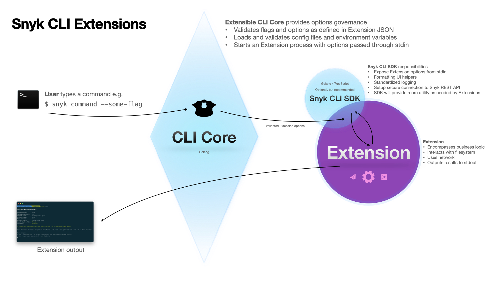

# CLI Extensions

**This is an early preview.**

**See [Extensible CLI](./extensible-cli.md) for wider context.**




Extensible CLI will comprise of, initially:

- **Core CLI** having well-defined responsibilities and providing capabilities to the Extensions.
- **Extensions**, at first developed by Snyk, that encapsulate non-core CLI functionality (`snyk test`, `snyk code test`, `snyk container test`, …), representing Snyk’s product offerings via a coherent and consistent CLI experience
- **Fallback mechanism** where Snyk CLI v1 is bundled into the Extensible CLI and used for any commands that are not satisfied by either the Extensible CLI Core or any of the extensions.

And, later:

- An ecosystem of third-party extensions, developed by Snyk’s customers, partners, and the broader ecosystem

The design endgame of the plugin system is to provide a universal multi-product interface that can power future workloads.

## Core CLI
Core CLI is the main executable that users are interacting with. It's a 1) broker for running extensions and a 2) provider of services for extensions.

### 1) Broker responsibility
Core CLI is aware of all available extensions - either bundled ones, local ones found on the user machine or in the future cloud or marketplace extensions available to be fetched and executed on-demand.

It can parse and validate available flags and options. Read Snyk configuration files and specific environment variables and match them to an extension.

### 2) Provider responsibility
Core is also providing services for the Extension - for example an HTTP Proxy, that abstracts away need for extensions to handle certificates, OS-defined proxies, negotiation protocols like Kerberos and more.

Core could also take care of reading, parsing and validating options from different sources: command flags, environment variables, config files, `.snyk` file and in the future for example also remote/Cloud options providers.

Extension developer is then able to focus on business logic for the extension. In an ideal world, this simplifies Extension integration testing story as well, as it can be modelled with `parsed-options -> output`.

## Extension

Extensions are not meant to be standalone CLI commands on their own. They should require Snyk CLI Core to be executed.

It's a fair abstraction to think about the Extension as an function that takes predefined parameters and returns an output. This framing also opens up a possibility to run CLI Extensions in different contexts if ever desired.

### Extension development lifecycle

#### Developing an extension locally
Extensions are meant to be developed in a separate repository, again with build and SDK toolkit provided by the Snyk CLI. See an example `list-projects` extension: [snyk-labs/sclix-list-projects](https://github.com/snyk-labs/sclix-list-projects).

Extensions also define they `extension.json` manifest in their repository. This serves as a base for validating options extension is expecting. This is further used for autogenerating features like `--help` or shell autocompletion.

Extension developer can use Snyk CLI to execute the extension behavior before integrating it into the Snyk CLI. By defining an extra filesystem path to look for extensions, Snyk CLI can execute ad hoc extensions. For example calling this command from the `sclix-list-projects` repository above will execute the `list-projects` command, even when this command is currently not available in the Snyk CLI:

```terminal
snyk list-projects --additional-extension-path=./
```

#### Integrating an extension to the Snyk CLI

Extensions are then integrated into the Snyk CLI by listing it in a bundled extensions JSON file. Example of such file:


```json
{
  "extensions": [
    {
      "repo": "https://github.com/snyk/sclix_woof",
      "commit_hash": "f5bfcf3d7df08af00470cd79d6d33d478cf4a483"
    }
  ]
}
```

Extensible CLI can support more than one bundled extension JSON in a directory, to allow fine-grained CODEOWNERS permission. This should give teams ability to maintain release lifecycle for the extensions they manage.

Once PR with a extension JSON is opened, the CLI will fetch, build and validate this extension. If all checks succeed, then built extension is bundled into the CLI and can be used by calling its appropriate command.
