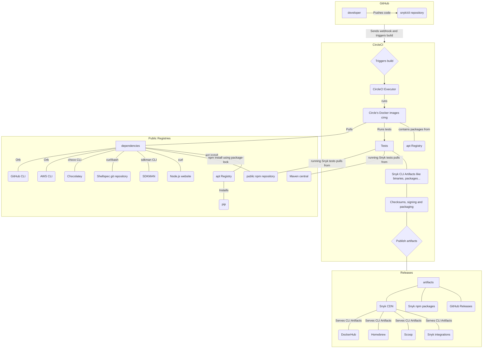

# Snyk CLI release pipeline

This document is describing Snyk CLI release pipeline. If you are looking for guidelines on how to release the Snyk CLI, see [CONTRIBUTING.md](../../CONTRIBUTING.md).

This is a rough outline of the Snyk CLI release pipeline. For an up to date steps of the CircleCI builds see [CircleCI config file](../../.circleci/config.yml).

## Notes

### How often are

Snyk CLI versions on CDN, GitHub Release and on npm are updated almost instantly.

Integrations like Homebrew, Scoop or Docker images are usually released less often. Once a day for Homebrew and Scoop and once a week for Docker images.
